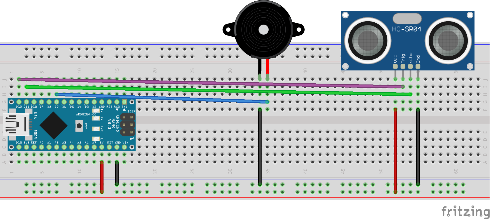

# Virtual Piano

Virtual piano that plays a different note according to the distance between an ultrasonic sensor and any object.

## Components
 - HC-SR04 Ultrasonic Sensor
 - Active Buzzer
 - Arduino Nano
 
## Schematics

## Demo

https://user-images.githubusercontent.com/14991778/120397515-bd830f80-c338-11eb-925a-1739fdb4c748.mp4
